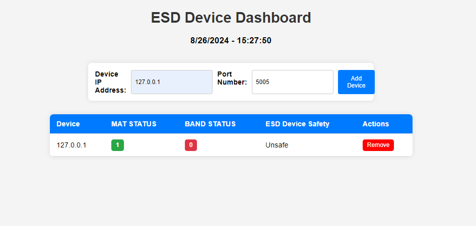

# ESD Device monitoring

We use a Raspberri Pico and Ethernet Wizenet W5500 and to monitor incoming data traffic streaming continuously.

The dashboard looks something like this - 


## Steps to run this project - 

```
git clone https://github.com/achyuthss-azranta/http-mqtt.git -b finale --single-branch
```

Next, in the root directory of the project, ensure you have an ``app.py`` & ``templates`` folder having ``test.html`` folder that has the frontend UI which can be seen by the user.

```
python app.py
```

Then, you can see the dashboard as below - 

